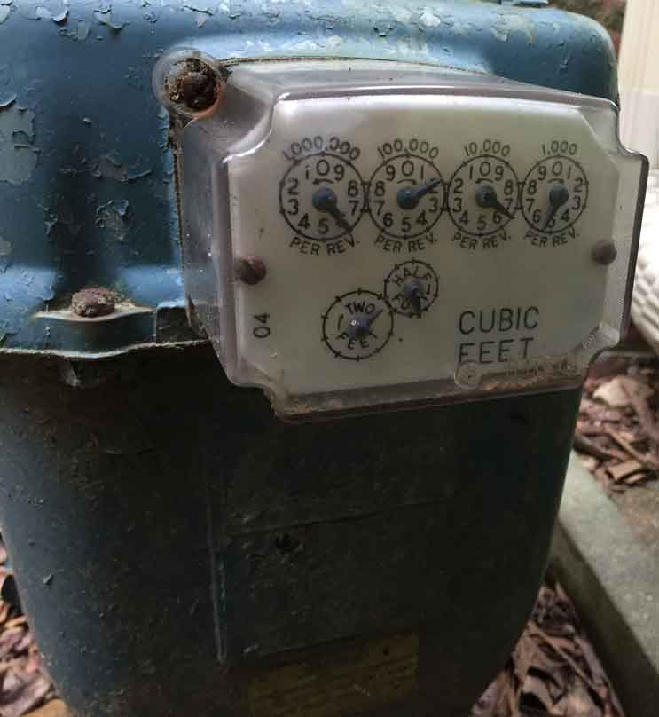
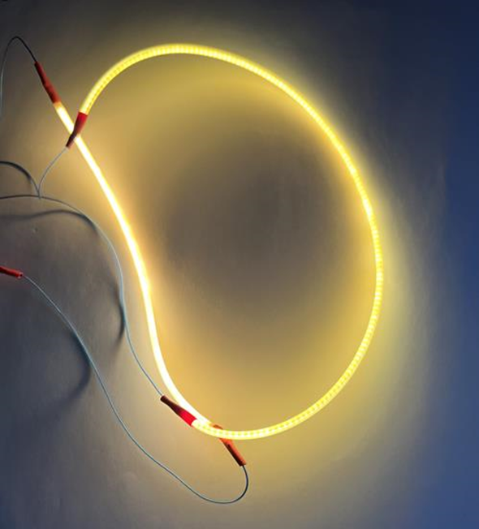
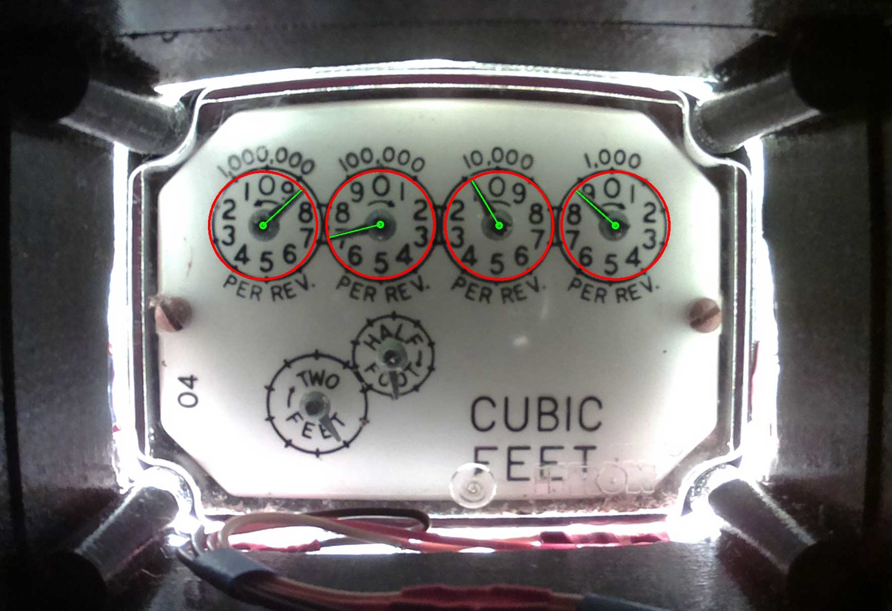
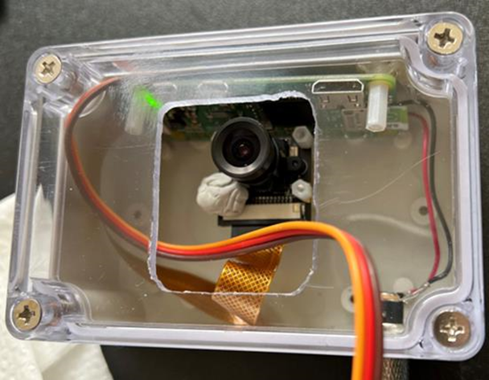
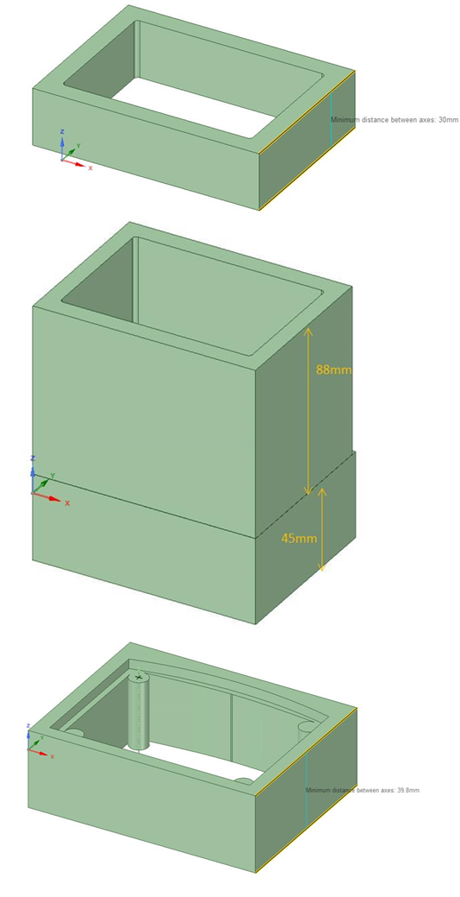

# Itron Analog Gas Meter Sensor for Home Assistant
This project provides an Itron gas meter sensor that can be used with Home Assistant.  In particular, this is for an Itron meter that looks like the following:


The gas meter is read by taking a picture of the gas meter and using image processing to determine the gauge's dial settings. As will be discussed later, the key success to this project is the illumination of the gas meter and the camera settings when capturing an image. <br/><br/>

This Project consists of the following software:
* Gasmeter Analyzer - This retrieves a picture image taken of the Itron gas meter, and with configured input from the user on dial coordinates, it deterimines which angle each dial's needle is pointing at, and converts this to a number.  The analyzer repeats this for each dial and then determines the "readout" value of the meter.  Once the value is determined, an MQTT Publish message is sent to an MQTT Broker containing the metered value.
* RaspberryPi Camera - Although any camera may work, this project uses a Raspberry Pi ZeroW and a first generation camera module to take images of the gas meter.  There are two Python code modules that are run on the Pi Camera:
  * Camera Image Capture - This Python code is used to take a picture of the meter.  It also turns on the lighting for the camera as well.
  * HTTP Web Server - This Python code is the http server for the Pi Camera.  It can be used to tell the PiCamera to capture an image, and it can be used to retrieve the image taken.  It can also be used to read the temperature of the Pi's CPU temperature monitor.
* Shell Script - A linux shell script that 1) sends to the RaspberryPi camera an http request for it to take a picture of the gas meter, and 2) subsequently calls the Gasmeter Analyzer (which gets the updated picture from the camera and runs the analysis).

Besides the Pi Camera, there are other hardware aspects to this project including 3D printed parts, which is covered in an annex at the end.

# Gasmeter Analyzer
The python3 code for the `gasmeter_analyzer` does the following:
* Retrieves the image from the camera for the configured URL of the Pi Camera,
* Rotates the image slightly in order to align the gauges along the horizontal plane.
* For a given Dial, it takes the configured "Center Coordinates" and "Radius", searches for and locates the needle, and with it, its angle and thus a value for each gauge.  
* "Reads the Meter" like a human.  A more significant gauge digit has its value determine in part based on its adjacent less significant gauge's digit value. As for the least significant gauge's dial which does not have an adjacent less significant gauge, it is taken at face value within two decimal places, (a hundreth).
* As a sanity check, it compares the just read meter value with a previously read meter value to make sure the values are never decreasing as the gas meter values are always increasing.
* Publishes an MQTT message to a broker containing the just read meter value.

Before the Gas Analyzer can be used, **an alignment process must be performed  and the dial coordinates need to be determined.** See the [Alignment and Coordinates Doc](./readme_media/Align_Coordinates.pdf).

Note: The code's image processing is rather CPU intensive and so one should take caution when deploying it on a system that needs to do other important/critical things as well. _I actually wanted to try this out on a PiZeroW, but opencv2 (which gasmeter_analyzer uses extensively) doesn't install so easily, and I didn't spend anymore time trying to get it to run._
 
## Theory of Operation
The `gasmeter_analyzer` takes the configured dial coordinates for an individual gauge (that is the center of rotation for the needle), and takes the configured radius and will draw a circle around the dial.  This circle should be nearly the same size as the gauge's circle on the face of the gas meter.  This circle is a single pixel in thickness and there will be several hundred pixels making up the circle.  The `gasmeter_analyzer` will next draw lines from the dial's center to each pixel in the circle and will also compute the angle of the drawn line with 0 degrees at the topmost point of the circle.  

From there it will compute the darkest line.  There are a couple of algorithms to choose from:  
1) One algorithm will use a user configured threshold to determine which pixels are gray to black in color, and then compute the number of these grayish black pixels for the drawn lines.  The drawn line with the most grayish black pixels is assummed to be the needle.  This is the preferred algorithm.
2) A second algorithm (which was the original algorithm) will compute an average grayscale for each line drawn.  As the needle is black in color, the `gasmeter_analyser` will look for the line with the darkest grayscale average value and assumes that line is the needle.  

Given the selected winning, it's angle is known, and a numeric value for the gauge is next computed to within a couple of fractional decimals (hundreths).  It should be noted too that the configured direction of the gauge's numbering, whether clockwise (CW) or counter-clockwise (CCW) is taken into account when computing the value.

Once all the gauges' dial values are determined, `gasmeter_analyzer` will come up with a meter value similarly to how a human would read the gauges and come up with a value.  One of the main drivers for reading the meter like a human, rather than taking the readings at face value and rounding to the nearest digit, has to do with the fact that there are some 3D distortions in the image regarding the dials and their needle. A needle may look on the image as if it is at, or has sightly gone past, a digit marker (we'll call the digit boundary) whereas in reality it has not.  A way to determine a more true value of a given gauge's needle position relative to a digit boundary is to look at the previous less significant gauge's dial value.  For example, if a needle looks on the image (and likewise as seen by `gasmeter_analyzer') like it has moved barely past digit '1', we can look at the previous digit, and if the previous digit has gone past '9' and is approaching '0' but not past '0', then the needle of interest has not yet moved past digit '1'. Each gauge's dial value is determined this way and then rounded down to the nearest integer value (0 to 9). The exception will be the very least significant gauge's dial (as it doesn't have a lesser signficant gauge) so the least significant gauge's dial value is taken at face value.  Next, all the gauge's dial values are put together to form the meter's value.

## Configuring
**Configuration YAML**<br/>
`config.yaml` - Enter the configuration in a file named config.yaml. A sample config.yaml file is provided. `gasmeter_analyzer.py` assumes config.yaml is located in the same directory, but gasmeter_analyzer.py will take in as an argument, the directory path of config.yaml. Ex. `$ gasmeter_analyzer.py /opt/gasmeter/venv_3.8/` will have gasmeter_analyzer.py use the config.yaml file located in /opt/gasmeter/venv_3.8/

**Configuration the URL of the Gas Meter Camera**
* `gasmeter_camera_ip` - IP address and Port to reach the gasmeter camera. HTTP GET requests are used with this. <br/>
  Example: `gasmeter_camera_ip: '192.168.0.2:8080'`
* `image_url_postfix` - The latter portion of the URL that is used to retrieve the gasmeter image.  It is generally the filename with an extension.  `gasmeter_analyzer` will accept `.jpg`, `.png`, and `.npy`. .npy is a Numpy 3D array of the image.  _I actually use a numpy file type. JPEG compression can be lossy, and although PNG is a lossless compression, gasmeter_analyzer uses opencv which operates on numpy arrays, so by using a numpy file of the image there is no extra step in conversion._ <br/>
  Example: `image_url_postfix: '/gasmeter_last.npy' #include forward slash`. <br/>
  With these examples, the final URL will be `http://192.168.0.2:8080/gasmeter_last.npy` <br/>

**Configuration For Local Operations**<br/>
_See the [Alignment and Coordinates Doc](./readme_media/Align_Coordinates.pdf) for help in determining some of the configured values mentioned here._
* `data_path` - The directory where gasmeter_analyzer will read/write files to.  These are mostly image files.
  For example, I use a Python venv directory: `data_path: "/opt/gasmeter/venv_3.8/"` <br/>
* `rotate_image` - Number of degress to rotate the image around its center. This is to align the meter along the horizontal with the camera.  Positive values of degrees will rotate the image counterclockwise. <br/>
  Example: `rotate_image: +0.5`
* ` gray_threshold` - To use the "Maximum number of grayish pixels" algorithm, choose a threshold between 1 and 255 (1 is black, 255 is white).  Values below this are considered grayish-black.  70 is recommended. A threshold of 0 will cause the original "averaging" algorithm to be used instead.  <br/>
* `circle_radius` - The distance, in number of pixels, from the center of the needle's axis of rotation to the tip of the needle. <br/>
  Example:  `circle_radius: 107`
* `gauge_centers` - The (x,y) coordinates, in number of pixels, for the center of the needle's axis of rotation.  (x=0,y=0) is located at the uppermost leftmost corner of the image.  The (x,y) values are always positive.  The coordinates are configured with the first item, `digit1`, representing the most significant gauge digit (from the Itron picture above its the upper leftmost gauge) and the last item, `digit4` representing the least signficant gauge digit (from the Itron picture above, it is the upper rightmost gauge). Note: The Analyzer code/debug uses gauge numbering with gauge1 as digit4, and gauge4 as digit1.<br/> 
  Example:
  ```
  gauge_centers:
    digit1:   #Most Signficant gauge digit
      x: 929
      y: 901
    digit2:
      x: 1163
      y: 900
    digit3:
      x: 1396
      y: 894
    digit4:   #Least Significant gauge digit
      x: 1625
      y: 897

  ```
* `circle_radius` - The distance, in number of pixels, from the center of the needle's axis of rotation to the tip of the needle. <br/>
  Example:  `circle_radius: 107`
* `readout_conventions` - The rotational direction of each gauge either `CW` for clockwise, or `CCW` for counter-clockwise. These conventions are configured with the first item (left most) representing digit1 (least signficant gauge digit (from the Itron picture above, it is the upper rightmost gauge)), and the last item representing digit4 (the most significant gauge digit (from the Itron picture above its the upper leftmost gauge)). <br/>
  Example of the Itron gasmeter picture above:
  ```
  readout_conventions: ["CW", "CCW", "CW", "CCW"]
  ```
* `center_radius` - This is considered an advanced tuning parameter.  When set to 0, it has no effect.  Otherwise it should be set close to the radius (in pixels) of the needle's spindle as seen in the image.  When set to 0, the algorithms will normally read the gray-ish-ness of the pixels of this spindle starting from the center of the spindle all the way to the end of the needle.  Setting this to non-zero value X will not read the first X pixels starting at the center of the spindle.  Depending on the lighting, the spindle closest to the lights can be light gray  and the part away from the light can be a darker and this can make a difference if some of the needle readings are close in the calculations.<br/>
  Example:  `center_radius: 30`

* `max_increase` - Sometimes misreadings can occur and when it happens, the resulting change from the previous reading can be large.  When a decrease occurs, the value read is ignored as the value should always be increasing (or no change). But when it increases, this parameter can apply a limit on how much an increase is considered as valid.  Setting the parameter to a value higher than what the meter is capable of displaying of course has no effect. If max_increase is exceeded, a couple of files are written which contains the misread value as part of the filename.  These can be used to see if any readjustments need to be made. <br/>
  Example:  `max_increase: 1.5`

**Configuration of MQTT Client** <br/>
`gasmeter_analyzer` provides an MQTT Client which uses a simple single shot publisher for each message sent to the broker.
* `client_name` - A name used by the broker to identify the gasmeter_analyzer as an MQTT client. <br/>
  Example: `client_name: "gasmeter_single_pub_client"`
* `host_name` - IP Address of the MQTT Broker. <br/>
  Example: `host_name: '192.168.3.11'`
* `username`and `password` - If you use authentication to access the MQTT broker, this is the username and password to be used. <br/>
  Example:
  ```
  username: "mqtt_user"
  password: "mqtt_passwd"
  ```
* `topic` - The topic used for sending the gas meter's value. <br/>
  Example: `topic: "gasmeter/outside/value"`
* `retain` - Whether to have the broker retain the gas meter's value. <br/>
  Example: `retain: "True" #"True" or "False".`<br/>

**Configure the Logger** <br/>
You can set the log level (none, info, debug) and where to send the output (local syslog or console).  When first using gasmeter_analyzer, you may want more detailed output and you may want it sent directly to the console instead of the syslogger.
* `level: 'info' #leave blank (no logs), set to 'debug' to get debug information, or 'info'. `
* `console: 0 #set to 1 to send output to stdout, 0 to local syslog`

## Gasmeter Analyzer - Restrictions
### Lighting
The most important aspect of the analyzer is the homogeneous lighting of the gasmeter's faceplate.  Sunlight of course is great, but at night, artificial lighting is required. During the development of this project, the following problems were discovered and can be used as a guide in your lighting situation (i.e. to avoid):
1. The clear plastic face of the Itron meter is highly reflective.  Any lighting of course has to be positioned to not reflect off of the dials.
2. The needles on the gauges are also reflective.  They are angled relative to the face of the meter, so lighting that is positioned near a dial can also reflect off of a needle.  You many not see this reflection until the needle has rotated to certain positions on the dial.  This kind of reflection causes the needle to be bright in the image, and keeps the analyzer from finding it.
3. The needles can cast shadows.  The needles are essentially a 3D object protruding above the white faceplate of the meter. If there are too few points of lighting shining on the meter, chances are that while most of the dial is nicely illuminated, part of the dial will be darker due to a shadowing effect caused by the needle.  Portions of a gauge's silkscreen has a lot of black.  The '0' position on the gauge is a prime example where there is the "tick" mark in black, followed by the topmost and then bottommost portion of the number '0' which is black, along with the "direction pointing arrow" which is also in black. If the needle is casting a shadow along this path, then the gasmeter_analyzer will see a lot of dark grayscale and may falsely interprete the needle as being in this position. <br/>

_My solution was to use "Edison LED filaments" wrapped around the front edge/sides of the meter for the lighting.  It provides hundreds of points of light, thus avoiding shadowing, and by wrapping it around the frontmost edge of the gasmeter's plastic casing, it avoids reflections while still illuminating the faceplate and the needles themselves._ <br/>


### Visual Perspective and Resolution
The Camera's distance from the meter has a tradeoff.  One would like the perspective (i.e. bird's eye view) to be such that the meter and its needles have no 3D distortion, so positioning the camera far from the meter makes this possible.  On the other hand, the `gasmeter_analyzer` will have a more finer grain resolution in computing the dial's angle when more circle pixels are used around a gauge (See Theory of Operation).  If the camera is too far away, one will end up with a small gauge in the image and thus fewer circle pixels around it and thus a more coarse resolution. Camera resolution also plays into this as a camera image with less resolution will also provide less circle pixels. This project ended up with around 6.5" of distance between the camera lens and the face of the gas meter, and with a camera resolution of 2592 x 1944, the number of circle pixels is several hundred. This provides a gasmeter resolution with around 2 decimal places of accuracy.

<br/>
_Here is what my final image looks like using proper lighting, various camera settings and distance, along with a camera resolution of 2592 x 1944.  It shows the gauge needles that Gasmeter Analyzer found in green, and the circle of pixels surrounding each dial._
<br/>
<br/>
# Raspbery Pi Camera Software

## 1) Camera Image Capture
`gasmeter_PiCamera.py` is a Python3 module used to take a picture of the gas meter and turn the lighting on and off during the exposure period. This code makes use of the PiCamera python library. There was one particular setting, the Average White Balance set to "greyworld", that was used which is only available using the "PiCamera Extras" library, so `picamerax` is used instead of the regular `picamera` library.  It should be noted that the PiZeroW used in this project runs on "Buster".  It uses one of the last versions of Buster that came out just prior to "Bullseye" being released. <br/>

**Lighting and Exposure Settings**<br/>
Besides lighting (discussed above), the camera settings and exposure are key in capturing a proper image of the gas meter.  This makes it easier for the Gas Meter Analyzer to properly locate the gauge needles.  Lots of trial and errors were made to come up with the proper settings and exposure times.  The key settings involve:
* Average White Balance - The Edison Filament LED used was a warm white 2200K which makes the gas meter's white face plate look nearly yellowish.  There are many AWB settings to choose from but 'Greyworld' was the only setting that really worked.  As the Gasmeter Analyzer is looking for dark needles relative to a lighter faceplate, it really shouldn't matter that the faceplate white correction is not purely white.
* Exposure Mode - Once the AWB was set, the exposure mode was tested.  Several settings were tried, and most did not have too many differences with `nightpreview` having a slight preference.  The one to avoid however is "fireworks".
* Meter Mode - This allows you to select a region(s) of the image that the camera will use to determine exposure. The way the Edison Filament LEDs are used as edge lighting, the outer portion of the gasmeter faceplate is well lit, while the center (where a lot of the dial area is located) is somewhat darker.  I chose the `spot` mode which uses a small portion of the center of the image.  This brightens up the center of the gasmeter faceplate and shows the dials a little better.  As the Gasmeter Analyzer is looking for dark needles relative to a lighter faceplate, the meter mode should not make too much difference.
* Exposure Time - This is the time between the camera module being activated and the image being captured.  This time allows the camera module's sensor and firmware to stabilize the image.  `sleep()` is used for this, and I found only a few seconds were needed.

There are lots of settings in the file that are commented out as it was deemed those particular settings were not appropriate or was not as good as others, so I just left them in there.<br/>


**LED Control** <br/>
The Edison Filament LEDs consists of two 3.3V filament strings, one 260mm, and one 130mm.  When each is used with a R=21Ω resistor, the drive current at 3.3(ish) volts is around 13mA which a Pi I/O can drive and stay under the 16mA often cited value as a workable maximum.  The code uses a couple of GPIOs to turn these two strings of LEDs on and Off.

The PiZeroW PCB and its attached Camera module PCB both have a small green and red LED respectively that when lit will reflect off of the gasmeter's faceplate.  To avoid this reflection, the code contains an LED class that can turn off/on the PiZeroW's LED, but not the camera module's LED.  There are techniques available to turn off the camera module's LED, but they are not deployed here.  Instead, I simply used some putty to cover the camera module's LED.
<br/>

**Configuration** <br/>
The code is not particularly structured for user configuration.  To make changes, you'll simply need to go through the code and make the changes that work for your setup.  In particular, make sure the capture resolution is set appropriate.  My PiCamera's camera module uses an OV5647 sensor, and I configured the resolution for 2592 x 1944 (WxH).
<br/>

**Image Files**<br/>
`gasmeter_PiCamera` saves image captured files in the Pi's ram directory located at `/run/shm/`.<br/>
It saves two files: `gasmeter_last.jpg` and `gasmeter_last.npy`.  The latter file is a numpy array of the captured image (uncompressed) in 'RGB' order).
<br/>

**Misc**<br/>
* `gasmeter_PiCamera.py` is structured to run standalone, but it can also be imported and run by another module, such as `gasmeter_http_server`.
* `picamerax` - As mentioned earlier, the ["PiCamera Extras library" (called picamerax)](https://picamerax.readthedocs.io/en/latest/) is used instead of the regular picamera library. Install it using `$pip3 install picamerax`
* `python3` - Make sure you run gasmeter_PiCamera.py using Python version 3.2 or higher.
<br/>

## 2) HTTP Web Server For Camera
`gasmeter_http_server` is Python3 code that is the http server for the Pi Camera (using `port 8080`).  It can be used for the following:
* To tell the PiCamera to capture an image.  A GET api url postfix `/api/capture_image` tells the webserver to call the Pi's Image capture code (See [Raspbery Pi Camera](./README.md#1-camera-image-capture)) above.  Example of the full URL: `http://192.168.0.2:8080/api/capture_image`
* Retrieve the image taken.  A GET url of "/gasmeter_last" with an extension of ".jpg", ".png" or ".npy" will retrieve the image file from /run/shm/ directory and provide it to the requestor.  Example of the full URL: `http://192.168.0.2:8080/gasmeter_last.jpg`.
* Read the temperature of the Pi's CPU temperature monitor. A GET api url postfix `api/cpu_temp` tells the webserver to read the PiZeroW's `thermal_zone0` and return the value in degrees celsius (in plain text).  Example of the full URL:  `http://192.168.0.2:8080/api/cpu_temp`.  In this example, it returns: `30.938`.

**Configuration** <br/>
There is not anything in particular that needs to be configured. Just be aware that out-of-the-box it is setup to use port 8080.

# Shell Script
`capture_analyze.sh` is a simple Linux Bash shell script that is provided with this project.  It provides two functions:
* Performs an HTTP GET request to the camera to take a picture of the gas meter, and then it waits a second.
* Runs the Gas Meter Analyzer.  It assumes the `gasmeter_analyzer` is in a Python3 virtual environment in a particular directory.  It can also pass in as an argument to gasmeter_analyaer.py the directory location of where the config.yaml file is located.  A sample is provided.
You will need to tailor this script somewhat to fit your needs.

In my project, a Cron facility is available and a job is setup to run the script every 45 minutes past the hour.  This gives enough time to run the script to completion  and have the gasmeter_analyzer provide an update to the MQTT broker and on to Home Assistant prior to hitting the next hour.  This gives Home Assistant's Energy Management component an updated reading just before it computes the next hourly interval of gas usage.  If interested, the cron entry I use is: 
```
45 0-23 * * * /opt/gasmeter/venv_3.8/capture_analyze.sh
```
# Credits
- Sonya Sawtelle: Wrote a nice and detailed Jupyter-based [blog](https://sdsawtelle.github.io/blog/output/automated-gauge-readout-with-opencv.html) on how to find a needle on an Itron Gas meter and interprete its angle.  The method `def find_needle` described in the blog is made use of in the `gasmeter_analyzer`.
- FunGuyPro: Put out a [YouTube](https://www.youtube.com/watch?app=desktop&v=LPHJNXNyK9M) that provided the idea of an enclosure for the Pi Camera.

# License
```
- MIT
```
# Annex
## Home Assistant - Gas Meter Sensor Configuration
The following YAML config was used to create an MQTT sensor in Home Assistant and this sensor can be used with its Energy Management integration.

```
sensor:
  # DIY Gasmeter
  - platform: mqtt
    unique_id: "13078054" 
    name: Gas Meter
    icon: mdi:gauge
    state_topic: "gasmeter/outside/value"
    unit_of_measurement: 'ft³' #Actual is ccf, but ccf not available in HA.
    device_class: 'gas'
    state_class: 'total_increasing' #value monotonically increasing
    value_template: " {{ ( value | multiply(1))  | round (2) }}"
```
The Gas Meter Analyzer outputs a MQTT value as read from the meter, and in my case, the Itron gas meter readings are in units of ccf. As of this writting, Home Assistant does not support ccf units for its Energy Management.  The closest thing is cubic feet.  I chose in my setup to use ft³ but _pretend_ they are units of ccf.  If one wants actual ccf values, one can change the multiplier in the value template to `multiply(100)`.
## Pi Camera Enclosure
<br/>
_My Raspberry Pi Camera and its enclosure._ <br/>
* ABS Junction box - A weatherproof ABS Junction box  with dimensions of 100x68x50mm was used.  The project started out with the idea of using a Pi Camera with built-in infrared lighting that would be housed in a standalone weatherproof box, and the camera would be simply placed somewhere close to the gas meter and take pictures of the meter as is.  But the lighting didn't work out for this, so a separate 3D printed enclosure was needed for the camera in order to achieve consistent lighting. The end result was that the "clear" portion of the ABS Junction box was inserted into the "Camera Adapter" side of the 3D enclosure, forming a fairly tight seal, and this meant that the front face of the camera box no longer had to be completely waterproof. Since I also needed cabling from the PiCamera I/O to the Edison Filament LED lighting, which was external to the ABS enclosure, I simply punched a square hole in the ABS enclosure to run the cabling.  This hole also provided a slightly clearer image for the camera.  
* Nylon Stand-offs - I used hex nylon standoffs that had built in nylon screws extruding from one and hot glued the flat end of the screws to the insides of the junction box.  As the PiZeroW and the camera module have holes in their PCBs, rhe hex screws were inserted throught these holes and were used to hold the boards in place.  Tall and matching nylon hex nuts were used to secure the modules in place.
* Waterproof Power Plugs - A hole was punched in the bottom of the enclosure and a waterproof female receptacle was mounted through the hole.  From there, a couple of wires were soldered to join the power plug to the PiZeroW.  An separate and external 2-pair powering cable was soldered to the male waterproof plug.  This provided a way to plug and unplug external power to the unit.
* Lighting Cables - JR/Futoba cables and plugs that are often used in Servo motor projects was used to provide the lighting cables.  The R=21Ω resistors were soldered in-line with the cables and heat shrink tubing was used.  The cable was made up of 2 halves, each end with a mating connector so that the ABS junction box could be disconnected from the lighting.

## Printed 3D Enclosure
This project uses a 3D printed enclosure.  This enclosure is used to mount the camera's ABS junction box on one side and the Itron part of the gas meter on the other side. It also has grooves to house the filament LEDs around the front edge of the Itron faceplate.  
<br/>
There are three separate 3D printed parts:
* Main body -  This is the main enclosure body (it is actually made up of longer versions of the other two parts that are combined into one). On the gasmeter facing side, it provides grooves  to give more spacing to the LED filaments when joined with the Itron Adatper part.  The 3D file for this is  `Itron_Box_Combo_xxx.stl`.
* Camera Adapter - An adapter for the camera's ABS junction box. The ABS junction box fits into it on one side, and this part is glued to the Main body on the other side.  It is used as an extension in order to provide more distance between the camera and the Itron faceplate. This file is `Box_Adapter_xxx`.stl
* Itron Adapter - An adapter for the Itron portion of the gas meter.  Not all Itron gas meter's have this mechanical style, so this may not fit your particular meter. This adapter also has a groove (on the side facing away from the meter) that is used to hold the Edison LED filaments in place. I hot glued the LED filament into these grooves. This groove positions the filament(s) to surround meter on its side near the front giving it an edge emitter type of illumination.  So when gluing the LED filament, make sure they remain inside the groove volume. The 3D file for this is `Itron_Adapter_FilamentLEDxxx.stl`.

I glued these three parts together using super-glue.  This allows one to assemble the LED into the groove more easily on the Itron side, and it allows for adding more distance on the camera side. <br/>
 

_The 3D enclosure was intended to surround the Itron part of the gas meter well enough to make it completely dark inside so that the LED illuminations could make the lighting consistent during both day time and night time.  However it didn't work out perfectly, so I ended up covering the Itron portion of the enclosure as well as the gas meter itself using a dark plastic sheeting and this made it completely dark inside (plus it adds a little more water-proofing too)._

## Future possiblities
There are future changes/additions that may be considered further down the road:
* Gasmeter Analyzer running directly on the PiZeroW.  If this turns out not to be feasible, then an option may be to get it working as an HA Add-On.
* `gasmeter_PiCamera.py` using PiCamera2 library running on Bullseye.
* Full blown MQTT client that includes availability/unavailable detection.
